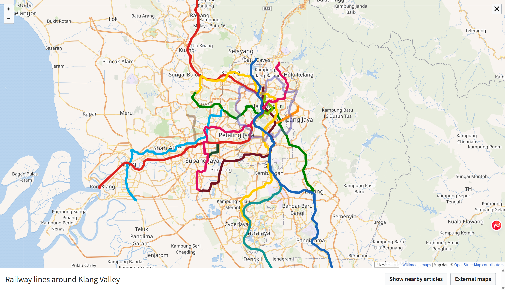
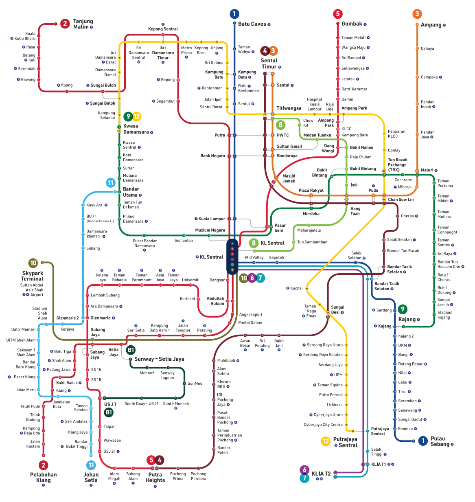
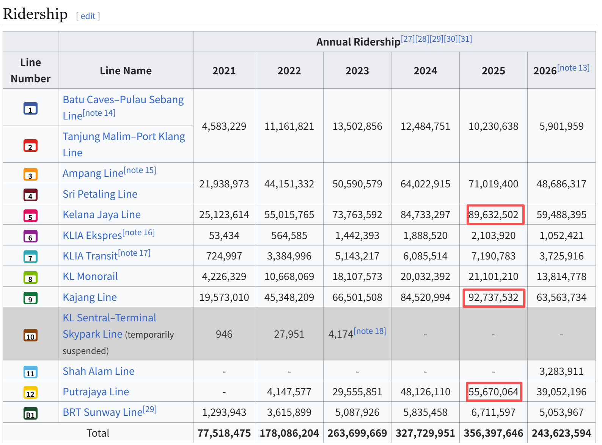
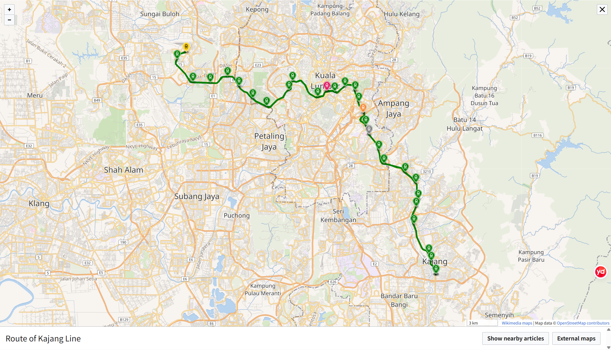
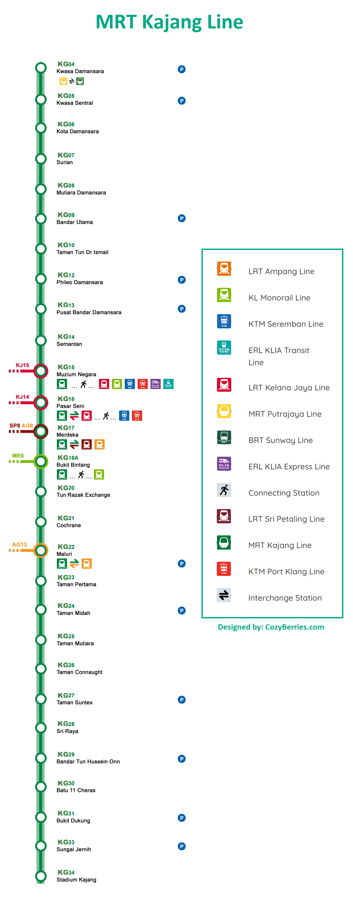
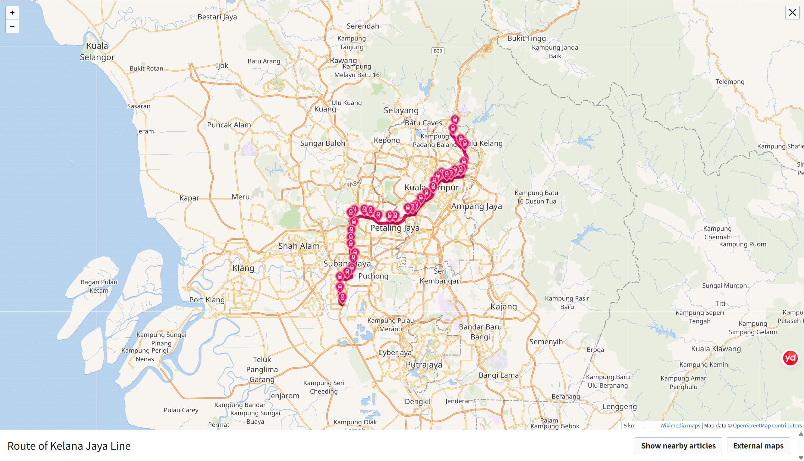
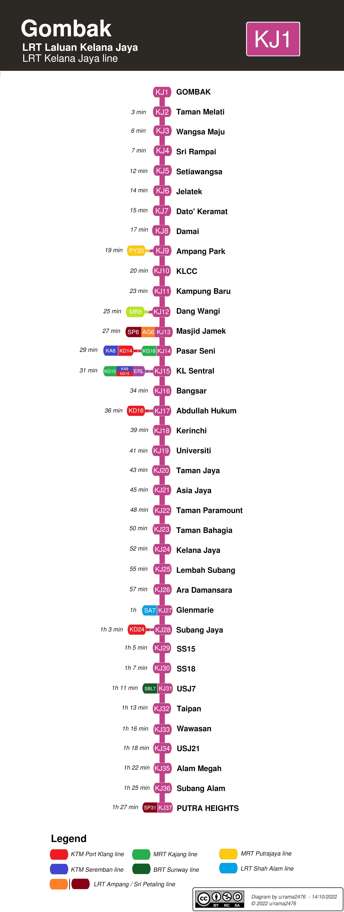
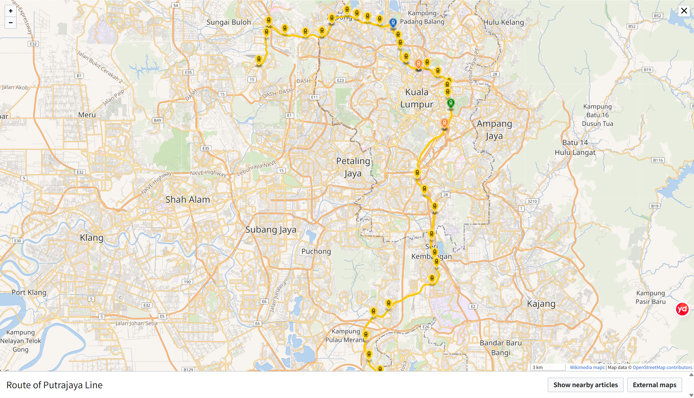
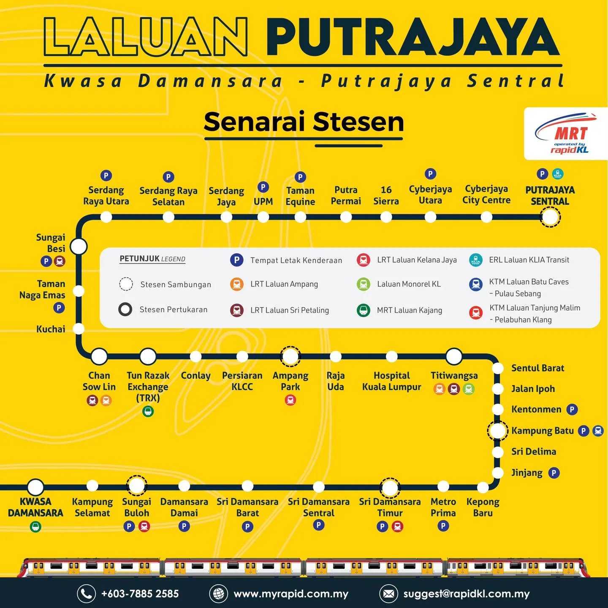

# 吉隆坡地铁分析

吉隆坡的地铁很复杂，一眼看去没有头绪，和国内也有许多区别。本文将从总体结构、重点线路和乘坐经验三个部分来分析吉隆坡地铁，希望对大家有所帮助。

## 一、总体结构：5种类型，12条线路

刚来吉隆坡时，我问一位劳工地铁站怎么走，我说“metro”，他听不懂，我说“subway”，他听不懂，我说“train”，他还是一脸茫然。我打开手机地图给他指，他终于恍然大悟：“MRT!"

一开始我还以为是自己发音不准，后来又问了几次路，发现他们都说“MRT”或“LRT”，而不说国际通用的“metro”，不说美国通用的“subway”，也不说宗主国英国通用的“underground”。

所以MRT、LRT到底是什么黑话呢？其实，他们分别是吉隆坡的两种地铁类型，高容量城市捷运和轻轨的简称，他们还有其他种类的轨道交通。总体来说，吉隆坡有5种轨道交通类型，12条线路，线路一般以名称和颜色区别。列举如下：

#### 1. 高容量城市捷运（MRT - Mass Rapid Transit）

- **Line 9 - 加影线（MRT Kajang Line / 深绿线）**
    
    - **起止**：Kwasa Damansara ↔ Kajang
        
    - **核心站点**：Pasar Seni（中央艺术坊）、Bukit Bintang（武吉免登）、TRX（敦拉萨国际贸易中心）。
        
    - **定位**：穿过吉隆坡市中心商业区与金融核心区的“黄金干线”。
        
- **Line 12 - 布城线（MRT Putrajaya Line / 黄线）**
    
    - **起止**：Kwasa Damansara ↔ Putrajaya Sentral
        
    - **核心站点**：Titiwangsa、KLCC East、TRX、Kuchai。
        
    - **定位**：南北大干线，直通马来西亚行政中心布城（Putrajaya）。
        

#### 2. 轻轨系统（LRT - Light Rail Transit）

- **Line 5 - 格拉那再也线（LRT Kelana Jaya Line / 桃红线）**
    
    - **核心站点**：KL Sentral、Pasar Seni、KLCC、Damai、Subang Jaya。
        
    - **定位**：全马客流量最高、使用率最密集的自动驾驶轻轨线。
        
- **Line 3 - 安邦线（LRT Ampang Line / 橙线）** 与 **Line 4 - 大城堡线（LRT Sri Petaling Line / 褐线）**
    
    - **定位**：连接吉隆坡东部（Ampang）及南部（Bukit Jalil、Srikembangan）老住宅区与市中心。
        
- **Line 11 - 沙亚南线（LRT Shah Alam Line / 天蓝线）**
    
    - **定位**：连接吉隆坡西部的巴生（Klang）与沙亚南（Shah Alam）地区。
        

#### 3. 市中心单轨与高架巴士（Monorail)

- **Line 8 - 吉隆坡单轨（KL Monorail / 浅绿线）**
    
    - **穿行区间**：KL Sentral ↔ Titiwangsa
        
    - **特点**：高架运行，穿越 Bukit Bintang 核心购物区。
        
- **BRT - 快捷公交双威线（BRT Sunway Line / 深绿线）**
    
    - 全高架专用道的电动巴士系统，连接双威城（Sunway）与 LRT/KTM 站点。
        

#### 4. 城际与通勤铁路（KTM Komuter）

- **Line 1 - 芙蓉线（Seremban Line / 蓝线）** 与 **Line 2 - 巴生港线（Port Klang Line / 红线）**
    
    - **运营方**：Malayan Railways (KTMB)
        
    - **特点**：覆盖雪兰莪及周边州属的重轨通勤列车，班次间隔相对较长。
        

#### 5. 机场轨道（ERL - Express Rail Link）

- **Line 6 - KLIA Ekspres（紫线）**：KL Sentral 直达吉隆坡国际机场（KLIA T1/T2），全程约 28 分钟。
    
- **Line 7 - KLIA Transit（水蓝线）**：机场通勤线，沿途停靠 Bandar Tasik Selatan、Putrajaya Sentral 等站。

（高清地图可在Rapid官网下载，网址：https://myrapid.com.my/bus-train/rapid-kl/rapid-kl-integrated-transit-map/#）

其中，Rapid Rail 公司运营轻轨（LRT)、捷运（MRT）和单轨（Monorail)及快捷公交双威线（BRT），大部分地铁都在其管理之下，占据吉隆坡轨道交通的主导地位。

KTMB（Keretapi Tanah Melayu Berhad / 马来亚铁道公司）运营城际与通勤铁路，1号线和2号线。

ERL（Express Rail Link Sdn Bhd/告诉铁路有限公司）运营机场线，这是个私营公司，所以票价非常贵，从市中心到机场要55马币，没比打车便宜多少。如果要省钱，可以先做布城线到布城中央车站，再坐一段机场线7号线（水蓝线）——这也是小红书推荐的最省钱的线路。

## 二、重点线路

总体来说，吉隆坡地铁有三条比较重要的线路，客运量最高，分别是9号绿线（加影线）、5号红线（格拉那再也线）和12号黄线（布城线），也是我最常坐的三条线。3号线和4号线运量也很大，但我没住过，就不讲了。

#### Line 9 - 加影线（MRT Kajang Line / 深绿线）

这条线自西北向东南，连接了西北部的 Damansara（白沙罗富人区/万达广场 1 Utama）与东南部的 Cheras（焦赖大型住宅区）和 Kajang（加影）。

中间穿过吉隆坡市中心，经过国家博物馆（Muzium Negara）、中央艺术坊（Pasar Seni）、Merdeka站（旁边的Merdeka 118是目前世界第二高的楼）、武吉免登（各国美女游客汇集的地方）、TRX（敦拉萨国际贸易中心）（新建的商场、金融中心）、双威伟乐城（Maluri站，华人比较集中的商业区）。

我本人就住在东南的马鲁里（Maluri）站附近，所以基本每次出行都坐这个地铁线。每天早上八点出头，是早高峰最严重的时候，有时排队等车的人可以从楼下排到楼上，车厢里塞到塞不下为止，场面之壮观，不在北京之下。

#### Line 5 - 格拉那再也线（LRT Kelana Jaya Line / 桃红线）

这条线是东北-西南走向，连接了吉隆坡市区和西边的梳邦再也（Subang Jaya）、八打灵再也（Petaling Jaya）两大卫星城，经过KL Sentral（吉隆坡中央车站）、Pasar Seni（中央艺术坊，靠近茨厂街、独立广场）、Masjid Jamek（占美清真寺）、KLCC（双峰塔/阳光广场）。如果你第一次来吉隆坡旅游，这条线是必坐的（哪怕不坐，也会看到）。

这条线据说还有很多高校（马来亚大学、泰莱大学等）和大厂（微软、shopee、三星等），我有个朋友天天坐这条线上学，每天挤地铁，过得可苦逼了。

#### Line 12 - 布城线（MRT Putrajaya Line / 黄线）

这条线是吉隆坡的南北大动脉，连接市中心和布城，布城是马来西亚的联邦政府行政中心，由于布城在吉隆坡机场和吉隆坡市中心之间，所以我们可以先坐这条线到布城，再坐机场线或机场接驳大巴，这就是最便宜的线路，从市中心到机场只需要13马币左右（坐大巴可能更低），而坐机场线则需要55马币左右，打车则是60-100马币都有可能。

这条线主要经过市区东边，经过Titiwangsa（蒂蒂旺沙）、Ampang Park（安邦公园）、KLCC East（双峰塔东站）、TRX（敦拉萨国际贸易中心）。

## 三、乘坐经验

我坐的不多，只提供有限的经验，希望大家多补充：
1. 问路的时候说“MRT"或”LRT“，这里不说”metro“、“subway”。
2. 这里没有几号线几号线的说法，虽然官方网站有序号，但车站里面根本没有，这里只能记颜色和线路名称。比如你说9号线，他们就不知道，你说Kajang Line或者绿线，大家都知道。记颜色也更好找一些。
3. 这里没有安检口，地铁安检大概是中国特色。
4. 可以现金买币乘车，但需要准备10马币或更小面额的纸币或硬币。那个机器现金买币很慢，而且用久了经常手里会多一堆硬币，所以不建议现金买票。
5. 也可以去柜台办理地铁卡，大概手续费只要5马币，很方便。不过有些柜台只能现金支付，有些则可以用Touch 'n Go (TnG)。
6. 坐扶梯一般左边的站着，右边的走，不想动的走左边，赶时间的走右边，特别不想动的（或者残疾人）坐直梯，特别想动的走楼梯。
7. 部分地铁有女士车厢，男生不要坐错了。粉红色，比较显眼，但时不时也能看到有男士傻乎乎进去的。
8. 空调很冷，室外和车内温差很大，老年人要提前准备（至少要有心理准备），不要感冒了。
9. 不能抽烟、吃东西、带榴莲。
10. 如果记不住站名，可以记号码。比如红线的Asia Jaya站是KJ21，你从Pasar Seni（KJ14）出发，就可以看每个站点的编号。如果这个站是KJ19，说明还有2站，如果是KJ25，说明你坐过了4站。

**参考资料**

1. **Wikipedia**. _Putrajaya Line_ [EB/OL]. 检索自 Wikipedia 维基百科条目.
    
2. **Wikipedia**. _Kajang Line_ [EB/OL]. 检索自 Wikipedia 维基百科条目.
    
3. **Wikipedia**. _Kelana Jaya Line_ [EB/OL]. 检索自 Wikipedia 维基百科条目.
    
4. **Wikipedia**. _Klang Valley Integrated Transit System_ [EB/OL]. 检索自 Wikipedia 维基百科条目.
    
5. **Rapid Rail Sdn Bhd**. _MyRapid Official Website_ [R/OL]. 官方网站: myrapid.com.my.