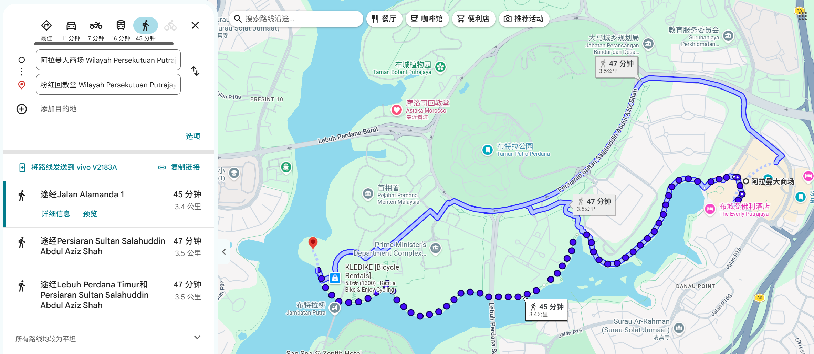
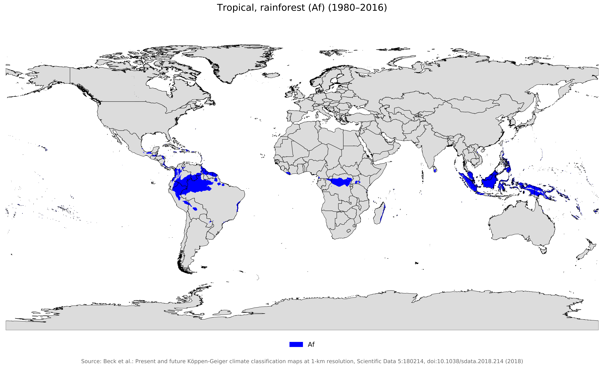
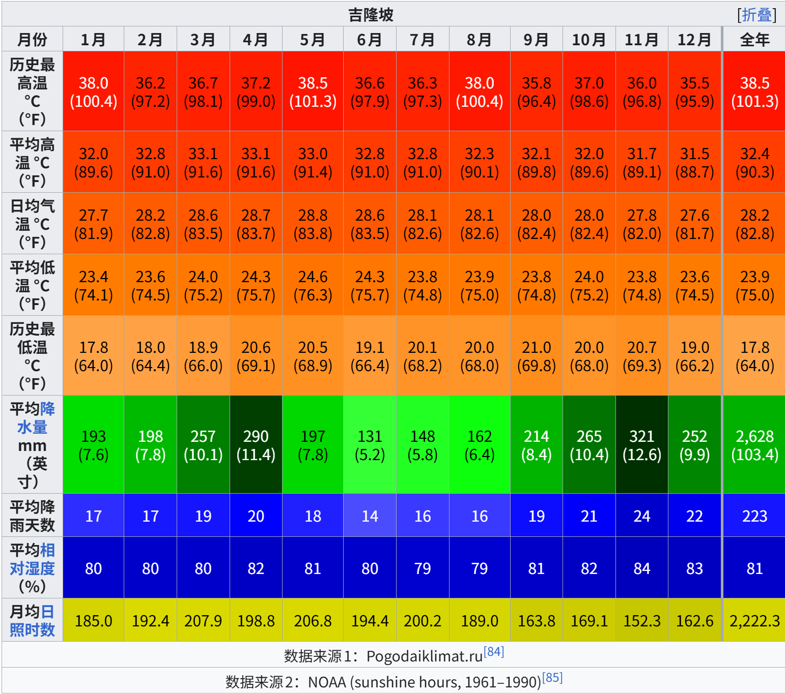
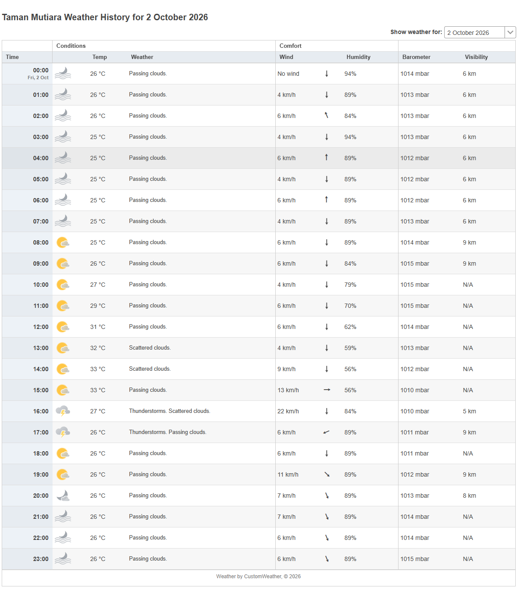

# 吉隆坡的天气分析

## 一、我低估了吉隆坡天气的恶劣程度

夏天的时候，我常常觉得吉隆坡的天气很好，因为当时国内很多地方都是伏旱天，温度接近40度的城市不在少数，相对来说吉隆坡天气就还行，每天都是32度左右，还经常下雨，雨水也多少缓解了酷暑。

但是现在已经10月，北京这种地方已经有些冷了，这时吉隆坡仍然32度左右的天气，就突然显得面目可憎。

上周二中午，我上完课陪同学回家，吃了个饭又出发去地铁站，两段路一共走了6公里左右。当时没有下雨，但也算不上烈日当空，气温32-34度之间，路上没有树荫遮蔽，后半段有总计50米的上坡，我背着10几斤重的包（包里有个游戏本），走了将近1万步。回家以后特别疲惫，几乎无法集中注意力，在空调房的沙发上躺了半小时才缓过来。

昨天，有两个同学来吉隆坡转机，有6小时的空余时间，我约他们在布城阿拉曼大商场见面，吃完午饭，我提议散步去粉红清真寺。这段路虽然风景优美，但当时也非常热，他俩还有个小行李箱，所以走得也很痛苦。现在看来这个提议真是糟透了。

这两件事情让我意识到，我低估了吉隆坡天气的恶劣程度。可谓是路遥知马力，日久见人心，现在我要重新评估吉隆坡的天气状况。

## 二、吉隆坡的气候

吉隆坡的地理坐标大致为北纬3.14°, 东经101.69°，距离赤道的直线距离不过350公里，所以全年太阳高度都很高，昼夜长度变化和季节温差都很小。

由于纬度偏低，吉隆坡受**热带低压带**支配，因此全年高温多雨，是典型的热带雨林气候。根据维基百科的数据，吉隆坡全年平均高温都在31.5°-33.1°之间，平均低温也在23.4°-24.6°之间，全年相差不大。

全年降水量2600毫米左右，相对来说，3-4月、10-12月，是吉隆坡的降水最多的时间段，6-8月则相对降水较少，但每月依旧大于100毫米。

吉隆坡也受季风影响，但影响不大。东北季风每年11月至3月，西南季风每年5月底至9月，其他时间则是转换期。东北季风较湿，西南季风较干。

## 三、典型的吉隆坡天气

吉隆坡全年温度差不多，一年220多天都下雨，下雨多是对流雨。所以我们可以总结出一种典型的吉隆坡天气：

| 时间              | 一般情况            | 对日常生活的意义        |
| --------------- | --------------- | --------------- |
| 06:00–10:00     | 通常相对少雨、温度较低     | **最适合户外活动**     |
| 10:00–13:00     | 日照增强，越来越热       | 多数时候仍比较稳定       |
| 13:00–15:00     | 积云快速发展          | 开始进入雷雨风险期       |
| **15:00–18:00** | **降雨、雷暴概率迅速升高** | **最值得防范**       |
| **16:00–19:00** | **大致是典型峰值区域**   | 强阵雨、雷电、阵风、交通拥堵  |
| 19:00–22:00     | 雷暴逐渐衰减，但仍可能持续   | 雨后通常明显降温        |
| 深夜–清晨           | 一般较稳定           | 但西南季风期可能有苏门答腊飑线 |

需要注意的是，受西南季风和苏门答腊岛影响，6-8月更可能在凌晨或上午降雨，这几个月本身也是相对少雨的季节。其他时间，我们会对这种典型情况有非常直观的感受：中午特别热，下午又突然降雨，有时还会雷暴，但不会持续太久，晚上雨停，变得稍稍凉快一些。

以2026年10月2日的天气为例，吉隆坡Taman Mutiara的一个气象台的观测结果如下：

最低温度是凌晨的26度，最高温度则是下午14点和15点的33度。16点、17点下起了大雨，迅速降温，18点天晴。非常典型的吉隆坡天气。

## 四、对吉隆坡天气的应对

这样仔细分析，我认为吉隆坡总体来说天气并不舒适，尤其是上午10点-下午17点，温度高、湿度大、风弱、太阳辐射强，如果再加上一定的活动量和负重，从热舒适度的角度讲，这就是debuff叠满了，难怪我上周二那样狼狈。

因此，在吉隆坡，白天不适合去户外散步，去商场没事。如果不得不中午出门，也最好做防晒，备雨伞。

凌晨和下午雨后会凉快很多，这个点出门一般也比较舒适。

## 五、参考资料

Time and Date AS. (n.d.). _Past weather in Taman Mutiara, Malaysia — Yesterday or further back_. Timeanddate.com. Retrieved October 5, 2026, from [https://www.timeanddate.com/weather/@12746875/historic](https://www.timeanddate.com/weather/@12746875/historic?utm_source=chatgpt.com)

_Tropical rainforest climate_. (n.d.). In _Wikipedia_. Retrieved October 5, 2026, from [https://en.wikipedia.org/wiki/Tropical_rainforest_climate](https://en.wikipedia.org/wiki/Tropical_rainforest_climate?utm_source=chatgpt.com)

_Kuala Lumpur_. (n.d.). In _Wikipedia_. Retrieved October 5, 2026, from [https://en.wikipedia.org/wiki/Kuala_Lumpur](https://en.wikipedia.org/wiki/Kuala_Lumpur?utm_source=chatgpt.com)

