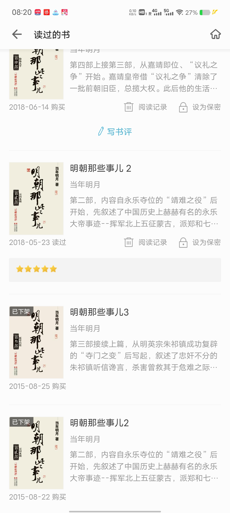
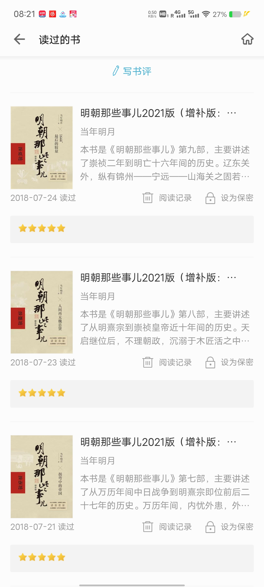
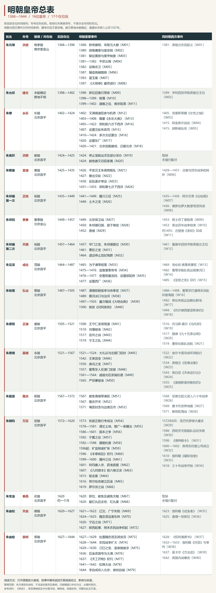

# 可供查阅的明朝皇帝-大事件表

初中高中的时候，在vivo读书里看完了《明朝那些事儿》的全9册，都是闲暇时候读的，因此没有做什么笔记，没有写总结，于是只有大概的印象，很多东西想不起来了，实在可惜。

明朝建立于1368年1月23日，灭亡于1644年4月25日，历经12世、16位皇帝，国祚276年（不记南明）。这段时间距今不过400-700年左右，不算特别远，当今中国还有不少明代的遗迹；这段时间又正好与欧洲的文艺复兴运动、地理大发现、宗教改革和科学革命有较多的重合期。所以对明朝做一个大概的梳理是有价值的事情。

要梳理一个古代的封建王朝，以皇帝在位时期为时间索引，比较方便整理和查阅。（这不代表我支持帝制，也不代表我要复兴大明。）我打算做一个表格，主要是方便自己唤醒记忆和查阅，也希望对读者有帮助。以下是我的梳理原则：

1. 列表，分别记录：姓名、年号、陵寝（包括陵寝名和所在地）、在位时间、在位大事件（列出时间）、同时期西方大事件（列出时间）。
2. 以在位时间为线索先后记录，在位两次的皇帝享有两行列表的特权。
3. 不记录肖像、庙号、谥号、在世时间。记录时间最多精确到月，不精确到日。
4. 年号和继位时间往往有一年的时间差，但是这个不重要，本表以实际在位时间为准。
5. 从朱元璋记录到朱由检。不记录朱元璋追封的先祖，也不记录南明政权的皇帝。（这不代表我不尊重明朝）
6. 影响历史的重要大事件必须记录，不因为某些皇帝在位时间长就减少事件的记录，反之亦然。
7. 所谓重要，主要包括：政权和继承变化、制度与财政变化、有长期影响的战争和外交事件，以及有代表性的社会和文化变化。
8. 采用“总表+事件详情”的结构输出，总表用于快速查阅和扫描，事件详情用于阅读。
9. 在位发生的大事件与皇帝本人并不一定有因果或强相关的关系，仅仅代表此事在他任内发生，望读者知悉。
10. 最后会附一张便于查看和转发的总表图片，可在我的GitHub地址下载无水印图。

以下表格由ChatGpt代劳生成，本人负责筛选、核查和修订，重要条目附来源、尚未确认的内容会注明。任何错误由我本人负责。

---

## 明朝皇帝总表

**读表说明**：以下按16位皇帝的17个实际在位段排列，朱祁镇的两次在位分别列出。相邻行共享换帝年份，不表示两位皇帝全年同时在位。年号栏只列名称；事件编号对应后面的详情。

日期以公历年份为主要展示口径。嘉靖四十五年十二月已经跨入公历1567年，所以朱厚熜的在位区间写为1521—1567。[^明表R04]

西方栏主要选取欧洲及其对外航海、殖民与贸易活动；同一时期的并列只提供时代参照。短在位段若未选到合适事件，保留暂缺。陵寝对应关系及建文葬地的不确定性见相关资料。[^明表R01][^明表R02][^明表R03]

| 姓名 | 年号 | 陵寝（名称与所在地） | 实际在位时间 | 明朝重要事件 | 同时期西方重要事件 |
|---|---|---|---|---|---|
| 朱元璋 | 洪武 | 明孝陵，南京紫金山 | 1368—1398 | 1368：称帝建明、攻取元大都〔M01〕 1380：胡惟庸案与废丞相〔M02〕 1381：赋役黄册与里甲制度〔M03〕 1381—1382：平定云南〔M04〕 1382：设锦衣卫〔M05〕 1387：编造鱼鳞图册〔M06〕 1393：蓝玉案〔M07〕 1397：《大明律》最终颁行〔M08〕 | 1381：英格兰农民起义〔W01〕 |
| 朱允炆 | 建文 | 葬地未能确证 | 1398—1402 | 1398：即位后推行宽政〔M09〕 1398—1399：削藩〔M10〕 1399—1402：靖难之役、南京陷落〔M11〕 | 1399：亨利四世夺取英格兰王位〔W02〕 |
| 朱棣 | 永乐 | 长陵，北京昌平 | 1402—1424 | 1402：文渊阁诸臣参与机务〔M12〕 1403—1408：编纂《永乐大典》〔M13〕 1405—1422：郑和前六次下西洋〔M14〕 1407：设置交趾布政司〔M15〕 1410—1424：多次北征蒙古〔M16〕 1420：设置东厂〔M17〕 1420—1421：北京宫殿建成、迁都北京〔M18〕 | 1405：克里斯蒂娜《女性之城》〔W03〕 1415：阿金库尔战役〔W04〕 1415：胡斯被处死〔W05〕 |
| 朱高炽 | 洪熙 | 献陵，北京昌平 | 1424—1425 | 1424：停止宝船出洋及部分采办〔M19〕 1424：赦免建文旧臣家属〔M20〕 | 暂缺（未强行配对） |
| 朱瞻基 | 宣德 | 景陵，北京昌平 | 1425—1435 | 1426：平定汉王朱高煦叛乱〔M21〕 1427：撤出交趾〔M22〕 1430：巡抚逐步常设〔M23〕 1431—1433：郑和第七次下西洋〔M24〕 | 1429—1431：贞德与百年战争的转折〔W06〕 |
| 朱祁镇（第一次） | 正统 | 裕陵，北京昌平 | 1435—1449 | 1441—1449：麓川三征〔M25〕 1449：土木之变〔M26〕 | 1435—1436：阿尔贝蒂《论绘画》〔W07〕 1436：佛罗伦萨大教堂穹顶完成〔W08〕 |
| 朱祁钰 | 景泰 | 景泰陵，北京金山 | 1449—1457 | 1449：北京保卫战〔M27〕 1450：朱祁镇归国、居于南宫〔M28〕 1452：易储〔M29〕 | 1453：君士坦丁堡陷落〔W09〕 1453：英法百年战争结束〔W10〕 约1455：古登堡《圣经》印成〔W11〕 |
| 朱祁镇（第二次） | 天顺 | 裕陵，北京昌平 | 1457—1464 | 1457：夺门之变、朱祁镇复位〔M30〕 1461：曹钦之变〔M31〕 1464：遗诏停止宫妃殉葬〔M32〕 | 1461：爱德华四世夺取英格兰王位〔W12〕 |
| 朱见深 | 成化 | 茂陵，北京昌平 | 1464—1487 | 1465：为于谦等昭雪〔M33〕 1475—1476：追复景泰帝号〔M34〕 1476—1477：安置荆襄流民、设置郧阳府〔M35〕 1477：设置西厂〔M36〕 | 1469：洛伦佐·美第奇掌权〔W13〕 1482：葡萄牙船队抵达刚果河口〔W14〕 1485：《亚瑟之死》印行〔W15〕 |
| 朱祐樘 | 弘治 | 泰陵，北京昌平 | 1487—1505 | 1487：清理前朝佞幸与传奉官〔M37〕 1489：黄河决口与治河〔M38〕 1497—1503：首次编成《大明会典》〔M39〕 1500：制定《问刑条例》〔M40〕 | 1488—1498：葡萄牙打通绕非洲赴印度海路〔W16〕 1492：哥伦布抵达加勒比群岛〔W17〕 1494：《托尔德西里亚斯条约》〔W18〕 |
| 朱厚照 | 正德 | 康陵，北京昌平 | 1505—1521 | 1508：王守仁龙场悟道〔M41〕 1510：刘瑾被诛〔M42〕 1517：应州之战〔M43〕 1519：宁王之乱〔M44〕 | 1516：托马斯·莫尔《乌托邦》〔W19〕 1517：路德《九十五条论纲》〔W20〕 1519：麦哲伦船队启航〔W21〕 |
| 朱厚熜 | 嘉靖 | 永陵，北京昌平 | 1521—1567 | 1521—1524：大礼议与左顺门廷杖〔M45〕 1542：壬寅宫变〔M46〕 1550：庚戌之变〔M47〕 1557：葡萄牙人在澳门定居〔M48〕 1561—1564：戚继光在浙闽抗倭〔M49〕 1565：严世蕃被诛〔M50〕 | 1522：埃尔卡诺完成环球航行〔W22〕 1534：英格兰《至尊法案》〔W23〕 1543：哥白尼《天体运行论》〔W24〕 1555：《奥格斯堡宗教和约》〔W25〕 |
| 朱载坖 | 隆庆 | 昭陵，北京昌平 | 1567—1572 | 1567：赦免海瑞等谏臣〔M51〕 1567：隆庆开关〔M52〕 1571：俺答封贡与边境互市〔M53〕 | 1568：尼德兰起义进入八十年战争〔W26〕 1569：墨卡托世界地图〔W27〕 1571：勒班陀海战〔W28〕 |
| 朱翊钧 | 万历 | 定陵，北京昌平 | 1572—1620 | 1573：张居正推行考成法〔M54〕 1578—1581：清丈土地、推广一条鞭法〔M55〕 1586—1601：国本之争〔M56〕 1592：宁夏之役〔M57〕 1592—1598：援朝抗倭〔M58〕 1596起：矿监税使扩张〔M59〕 1596：《本草纲目》初刊〔M60〕 1599—1600：播州之役〔M61〕 1601：利玛窦入京、获准居留〔M62〕 1607：《几何原本》前六卷汉译〔M63〕 1615：梃击案〔M64〕 1616：努尔哈赤建立后金〔M65〕 1619：萨尔浒之战〔M66〕 | 1572年8月：圣巴托罗缪大屠杀〔W29〕 1588：西班牙无敌舰队远征失败〔W30〕 1598：《南特敕令》〔W31〕 1600—1602：英荷东印度公司成立〔W32〕 1610：伽利略《星际信使》〔W33〕 1618：三十年战争开始〔W34〕 |
| 朱常洛 | 泰昌 | 庆陵，北京昌平 | 1620（约一月） | 1620：即位、赦免及蠲免灾赋〔M67〕 1620：服红丸后去世、红丸案〔M68〕 | 暂缺（未强行配对） |
| 朱由校 | 天启 | 德陵，北京昌平 | 1620—1627 | 1621—1622：辽沈、广宁失陷〔M69〕 1624—1625：魏忠贤迫害东林〔M70〕 1626：宁远之战〔M71〕 1627：陕西起事、明末农民战争初起〔M72〕 | 1623：伽利略《试金者》〔W35〕 1625：查理一世即位〔W36〕 |
| 朱由检 | 崇祯 | 思陵，北京昌平 | 1627—1644 | 1627—1629：处置魏忠贤及其党羽〔M73〕 1628—1644：农民战争扩大〔M74〕 1629—1630：己巳之变、袁崇焕被杀〔M75〕 1636：后金改国号为大清〔M76〕 1637：《天工开物》初刊〔M77〕 1641—1642：松锦大战〔M78〕 1644：李自成攻入北京、崇祯自缢〔M79〕 | 1628：《权利请愿书》〔W37〕 1632—1633：伽利略《对话》与审判〔W38〕 1637：笛卡尔《方法谈》〔W39〕 1642：英国内战爆发〔W40〕 |

## 事件详情

以下按在位段排列。编号、时间和事件名称与总表及图片一致；事件的作用与影响是整理说明，不等同于对皇帝个人功过的判断。

### 朱元璋｜洪武｜1368—1398

**明朝事件**

- **M01｜1368：称帝建明、攻取元大都。** 朱元璋在南京称帝，建立明朝；徐达率军攻入大都，元朝在中原的统治结束，统一战争仍继续。[^明表R05]

- **M02｜1380：胡惟庸案与废丞相。** 胡惟庸被诛后，朝廷废除中书省与丞相，由皇帝直接统辖六部，并改设五军都督府；中央权力结构由此发生重大变化。[^明表R05]

- **M03｜1381：赋役黄册与里甲制度。** 朝廷编制赋役黄册，按里甲组织登记人口、财产与赋役；它成为地方编户及征收税役的重要依据。[^明表R06][^明表R07][^明表R08]

- **M04｜1381—1382：平定云南。** 傅友德、蓝玉、沐英等率军进入云南，击败元朝残余势力，攻取曲靖、大理等地；明朝对云南的军事与行政控制随之加强。[^明表R05][^明表R09]

- **M05｜1382：设锦衣卫。** 锦衣卫由皇帝直接控制，兼有侍卫、缉捕及审讯等职责；它成为明朝皇权监察体系的重要机构。[^明表R10]

- **M06｜1387：编造鱼鳞图册。** 朝廷派员核实田地，绘制田图并登记田主、面积与界址；鱼鳞图册以土地为中心，与以户口为中心的黄册互为补充。[^明表R06]

- **M07｜1393：蓝玉案。** 蓝玉以谋反罪被诛，案件扩大牵连多人；开国武将集团进一步受到打击，皇帝对军事力量的控制加强。[^明表R09]

- **M08｜1397：《大明律》最终颁行。** 经过多次修订，《大明律》在洪武三十年定稿颁行；它确立了此后明朝基本刑律的框架。[^明表R11]

**同时期西方事件**

- **W01｜1381：英格兰农民起义。** 英格兰发生以瓦特·泰勒等人为代表的农民起义，理查二世与起义者交涉，随后起义受到镇压。它提供了观察晚期中世纪社会矛盾与王权应对的一个节点。[^明表R12]

### 朱允炆｜建文｜1398—1402

**明朝事件**

- **M09｜1398：即位后推行宽政。** 建文帝裁减部分冗员、蠲免积欠赋税，并调整洪武末年的严厉政治措施；这些举措体现了新朝的政策转向。[^明表R03]

- **M10｜1398—1399：削藩。** 朝廷先后处置周王、齐王、代王、岷王等藩王，试图削弱宗室的地方势力；皇帝与燕王朱棣之间的矛盾随之加深。[^明表R03]

- **M11｜1399—1402：靖难之役、南京陷落。** 朱棣起兵，与建文朝廷争夺皇位，最终攻入南京；建文帝在宫中火灾后的下落，史料记载存在分歧，不能据此断定其死亡地点或陵寝。[^明表R03]

**同时期西方事件**

- **W02｜1399：亨利四世夺取英格兰王位。** 亨利·博林布鲁克返回英格兰，废黜理查二世并以亨利四世身份即位。英格兰王位更替可与这一时期中国的继承问题并置观察，但两者并无因果联系。[^明表R12]

### 朱棣｜永乐｜1402—1424

**明朝事件**

- **M12｜1402：文渊阁诸臣参与机务。** 朱棣命解缙、黄淮等入直文渊阁，参与机务；这一安排成为明代内阁制度逐渐形成的重要起点，此时尚不是后来成熟的内阁体制。[^明表R13]

- **M13｜1403—1408：编纂《永乐大典》。** 朝廷组织大规模类书编纂，1407年基本定稿并定名《永乐大典》，1408年完成誊抄；大量前代文献由此汇集保存。[^明表R14][^明表R15]

- **M14｜1405—1422：郑和前六次下西洋。** 郑和船队六次出航，活动于东南亚、印度洋等地，开展朝贡外交、贸易与人员交流；它扩大了明朝对海外世界的接触。[^明表R16][^明表R17][^明表R18]

- **M15｜1407：设置交趾布政司。** 明军击败越南胡朝后，朝廷设置交趾布政司，直接统治当地；持续的反抗与战争后来促成宣德朝撤军。[^明表R17]

- **M16｜1410—1424：多次北征蒙古。** 朱棣多次亲率大军北征蒙古，试图消除北方军事威胁；这些战争强化了北京作为北方政治、军事中心的地位，也需要大量军需。[^明表R17][^明表R18]

- **M17｜1420：设置东厂。** 朝廷设置东厂，由宦官主持侦察事务；宦官对官员与社会的监察权进一步扩大。[^明表R18]

- **M18｜1420—1421：北京宫殿建成、迁都北京。** 北京宫殿营建完成后，朝廷于1421年正式迁都北京，南京保留为留都；明朝的政治重心由此北移。[^明表R18][^明表R19]

**同时期西方事件**

- **W03｜1405：克里斯蒂娜《女性之城》。** 克里斯蒂娜·德·皮桑发表《女性之城》，通过历史与寓言中的女性事迹回应对女性的贬低。它是欧洲女性写作与思想史的重要作品。[^明表R20]

- **W04｜1415：阿金库尔战役。** 英军在阿金库尔击败法军，是英法百年战争的一次重要战役。百年战争从1337年延续至1453年，这场胜利强化了英格兰在战争中的地位。[^明表R20][^明表R21]

- **W05｜1415：胡斯被处死。** 波希米亚改革者扬·胡斯被以异端之名处死，追随者此后发动持续多年的运动。他对教会腐败与权威的批评可作为16世纪宗教改革的前史。[^明表R22]

### 朱高炽｜洪熙｜1424—1425

**明朝事件**

- **M19｜1424：停止宝船出洋及部分采办。** 即位后，洪熙帝下令停止宝船出洋及部分采办等事务；朝廷开始收缩永乐时期耗费较多的部分活动。[^明表R23][^明表R24]

- **M20｜1424：赦免建文旧臣家属。** 洪熙帝赦免部分被罚为奴的建文旧臣家属，恢复其自由并归还田产；靖难之后的政治惩罚有所缓和。[^明表R23][^明表R24]

**同时期西方事件**

本段暂缺。这里仅表示未选入合适的参照事件，不表示同期没有重要变化。

### 朱瞻基｜宣德｜1425—1435

**明朝事件**

- **M21｜1426：平定汉王朱高煦叛乱。** 汉王朱高煦起兵后，宣德帝亲征并将其擒获；皇位继承得到巩固，藩王再次挑战中央的行动遭到镇压。[^明表R25]

- **M22｜1427：撤出交趾。** 明军与黎利方面议和，宣德帝下令召回交趾的文武官吏和军队；明朝在当地的直接统治结束，东南边疆政策由占领转向外交处理。[^明表R25]

- **M23｜1430：巡抚逐步常设。** 朝廷扩大并逐渐稳定巡抚的派驻，强化中央对地方行政、财政和治安的协调；巡抚并非此年才首次出现。[^明表R26]

- **M24｜1431—1433：郑和第七次下西洋。** 宣德帝于1430年下令再次出航，船队在1431—1433年完成第七次远航；这是明廷最后一次大规模组织郑和船队出洋。[^明表R27][^明表R26]

**同时期西方事件**

- **W06｜1429—1431：贞德与百年战争的转折。** 1429年贞德协助查理七世在兰斯加冕，1431年她在鲁昂被处死。这组事件展示战争中的王权合法性与宗教动员；战争直到1453年才结束。[^明表R20]

### 朱祁镇（第一次）｜正统｜1435—1449

**明朝事件**

- **M25｜1441—1449：麓川三征。** 明朝先后三次大举征讨麓川思氏势力，维持云南边境控制；长期用兵也消耗了朝廷与地方的军需资源。[^明表R28]

- **M26｜1449：土木之变。** 朱祁镇亲征瓦剌，明军在土木堡附近遭到惨败，朱祁镇被俘；朝廷随后拥立朱祁钰，北京面临直接军事危机。[^明表R28]

**同时期西方事件**

- **W07｜1435—1436：阿尔贝蒂《论绘画》。** 阿尔贝蒂撰写《论绘画》，系统讨论绘画理论、透视与画家的工作。它代表文艺复兴把艺术实践、古典知识与空间表达结合的努力。[^明表R29]

- **W08｜1436：佛罗伦萨大教堂穹顶完成。** 布鲁内莱斯基设计的佛罗伦萨大教堂穹顶完成，是文艺复兴建筑与工程的重要成果。它体现了建筑实践、工程技术与城市公共建设的结合。[^明表R29]

### 朱祁钰｜景泰｜1449—1457

**明朝事件**

- **M27｜1449：北京保卫战。** 于谦等组织京师防御，击退瓦剌进攻；明朝保住北京，土木之变后的中央政权危机暂时缓解。[^明表R30]

- **M28｜1450：朱祁镇归国、居于南宫。** 被俘的朱祁镇获释归国，随后居于南宫，景泰帝继续在位；同一皇室中出现了在位皇帝与归国前帝并存的局面。[^明表R30]

- **M29｜1452：易储。** 景泰帝废朱见深的皇太子身份，改立自己的儿子朱见济；皇位继承问题进一步影响景泰、朱祁镇两系之间的关系。[^明表R30]

**同时期西方事件**

- **W09｜1453：君士坦丁堡陷落。** 奥斯曼帝国攻陷君士坦丁堡，拜占庭帝国灭亡。这是东地中海权力格局重组的重要节点。[^明表R31]

- **W10｜1453：英法百年战争结束。** 法军在卡斯蒂永战役获胜，英格兰在法国的主要领土逐渐丧失，百年战争通常以此年为终点。长期战争的结束推动法国王权与国家结构进一步整合。[^明表R20]

- **W11｜约1455：古登堡《圣经》印成。** 古登堡《圣经》印成，成为欧洲活字印刷传播的重要节点，推动书籍与知识流通。欧洲此时的印刷发展晚于东亚的活字印刷传统。[^明表R22]

### 朱祁镇（第二次）｜天顺｜1457—1464

**明朝事件**

- **M30｜1457：夺门之变、朱祁镇复位。** 石亨、徐有贞等迎朱祁镇复位，景泰帝被废；于谦、王文被杀，朝廷权力与皇位继承再次发生转折。[^明表R32]

- **M31｜1461：曹钦之变。** 曹钦在北京起兵，试图控制宫禁，最终被朝廷军队击败；这一事件暴露了复位后武臣势力与皇权之间的紧张。[^明表R32]

- **M32｜1464：遗诏停止宫妃殉葬。** 朱祁镇临终遗诏要求宫妃不得殉葬；明初以来以宫妃陪殉帝陵的制度由此停止。[^明表R32]

**同时期西方事件**

- **W12｜1461：爱德华四世夺取英格兰王位。** 1461年爱德华四世即位，并在陶顿战役击败兰开斯特派，巩固王位。它是玫瑰战争中的一次王朝更替，战争此后仍在继续。[^明表R33][^明表R34]

### 朱见深｜成化｜1464—1487

**明朝事件**

- **M33｜1465：为于谦等昭雪。** 朝廷为于谦昭雪，并释放部分相关家属；夺门之变后的一些政治冤案得到纠正。[^明表R35]

- **M34｜1475—1476：追复景泰帝号。** 朝廷在成化十一年冬追复朱祁钰的皇帝身份，并修饰其陵寝；景泰朝在官方皇统中的地位得到重新确认。[^明表R35][^明表R30]

- **M35｜1476—1477：安置荆襄流民、设置郧阳府。** 原杰等清理荆襄地区流民，登记入籍并组织安置，1477年设置郧阳府；朝廷以编户、设府和分配闲田等方式加强对山区人口的管理。[^明表R36][^明表R06][^明表R37]

- **M36｜1477：设置西厂。** 朝廷设西厂，由汪直主持侦察事务；厂卫监察进一步扩张，并引发官员对其越权行为的反对。[^明表R36][^明表R35]

**同时期西方事件**

- **W13｜1469：洛伦佐·美第奇掌权。** 洛伦佐·美第奇掌握佛罗伦萨的政治影响力，赞助诗人、哲学家和艺术家。其宫廷成为观察人文主义与文艺复兴艺术发展的一个中心。[^明表R29]

- **W14｜1482：葡萄牙船队抵达刚果河口。** 迪奥戈·康率领的葡萄牙探航抵达刚果河口。它是葡萄牙沿非洲西岸推进航海探索的重要一步，也为后续绕非洲航路提供背景。[^明表R38]

- **W15｜1485：《亚瑟之死》印行。** 威廉·卡克斯顿印行托马斯·马洛礼的《亚瑟之死》。这部作品与卡克斯顿的出版活动展示了欧洲印刷术如何进入本土语言文学的传播。[^明表R39]

### 朱祐樘｜弘治｜1487—1505

**明朝事件**

- **M37｜1487：清理前朝佞幸与传奉官。** 即位后，弘治帝处置梁芳、李孜省等前朝权势人物，并裁汰部分未经正常选官程序授职的传奉官；朝廷开始整顿人事与行政秩序。[^明表R40]

- **M38｜1489：黄河决口与治河。** 黄河在开封一带决口，朝廷调集人力治理河患；黄河防洪及其对民生、交通的影响成为本朝重要事务。[^明表R40]

- **M39｜1497—1503：首次编成《大明会典》。** 朝廷从1497年组织编纂，至弘治十五年十二月、即公历1503年初完成；该书系统汇总官署职掌与典章制度，弘治朝尚未刊行。[^明表R40][^明表R41][^明表R42]

- **M40｜1500：制定《问刑条例》。** 朝廷制定《问刑条例》，对实践中的刑事审判规则加以整理；明朝法律运作在基本律文之外进一步发展出条例体系。[^明表R40]

**同时期西方事件**

- **W16｜1488—1498：葡萄牙打通绕非洲赴印度海路。** 1488年迪亚士绕过非洲南端；1498年达·伽马经绕非洲海路抵达印度。绕非洲连接欧洲与印度的海路由此建立，推动贸易与殖民竞争扩展。[^明表R38]

- **W17｜1492：哥伦布抵达加勒比群岛。** 哥伦布横渡大西洋抵达加勒比群岛，是此后欧洲与美洲持续接触和殖民扩张的关键节点。大西洋航路逐步把欧洲、美洲与其他地区连接起来。[^明表R38]

- **W18｜1494：《托尔德西里亚斯条约》。** 卡斯蒂利亚王室与葡萄牙约定以佛得角群岛以西370里格的一条南北界线划分海外扩张权利。条约展示大航海与国家竞争的结合，属于两国的权利主张，不是全世界普遍认可的分界。[^明表R43][^明表R44]

### 朱厚照｜正德｜1505—1521

**明朝事件**

- **M41｜1508：王守仁龙场悟道。** 被贬贵州龙场的王守仁在困境中发展其对心与理关系的认识；龙场悟道成为阳明心学形成的重要转折，后来的学说仍继续发展。[^明表R45]

- **M42｜1510：刘瑾被诛。** 宦官刘瑾被揭发并处死，其党羽受到追究；此前由刘瑾控制的重要权力网络被打破。[^明表R46]

- **M43｜1517：应州之战。** 明军在应州与蒙古军交战，朱厚照参与指挥；这一战役是本朝北部边防的重要事件。[^明表R46]

- **M44｜1519：宁王之乱。** 宁王朱宸濠起兵，王守仁迅速组织军队平定并将其擒获；又一次藩王争夺皇位的行动失败。[^明表R46]

**同时期西方事件**

- **W19｜1516：托马斯·莫尔《乌托邦》。** 莫尔发表《乌托邦》，借理想社会的叙述讽刺现实中的政治腐败与社会失衡。它是文艺复兴人文主义文学与政治思考的代表性作品。[^明表R39][^明表R47]

- **W20｜1517：路德《九十五条论纲》。** 路德发表批评赎罪券等问题的《九十五条论纲》，通常被视为宗教改革开端的标志事件。其批评迅速传播，推动欧洲教会与政治秩序发生深刻变化。[^明表R48]

- **W21｜1519：麦哲伦船队启航。** 麦哲伦率船队离开西班牙，寻找向西抵达香料群岛的航路。此次航行延续至1522年，开始于正德时期，完成于嘉靖时期。[^明表R38]

### 朱厚熜｜嘉靖｜1521—1567

**明朝事件**

- **M45｜1521—1524：大礼议与左顺门廷杖。** 嘉靖帝与官员围绕其生父的尊号及皇统关系长期争执，1524年发生左顺门抗争与廷杖；礼制争议转化为皇帝与官僚之间的重大政治冲突。[^明表R49]

- **M46｜1542：壬寅宫变。** 一批宫女试图杀死嘉靖帝，行动失败后受到镇压；此事成为嘉靖朝宫廷政治的重要危机。[^明表R49]

- **M47｜1550：庚戌之变。** 俺答率蒙古军逼近北京，京师戒严；北方防御的薄弱暴露，明廷与蒙古的战争、贸易关系仍待调整。[^明表R49]

- **M48｜1557：葡萄牙人在澳门定居。** 葡萄牙人开始在澳门定居并经营贸易，澳门逐渐成为中外商贸与文化交流的重要据点；澳门仍处于明廷主权之下。[^明表R50]

- **M49｜1561—1564：戚继光在浙闽抗倭。** 戚继光训练军队，在1561年台州等战斗及其后的福建作战中击败倭寇；与俞大猷等将领的行动共同推动了东南海防形势的改善。[^明表R51][^明表R52]

- **M50｜1565：严世蕃被诛。** 严嵩失势后，严世蕃被处死；长期影响嘉靖朝政治的严氏权力集团受到进一步打击。[^明表R49]

**同时期西方事件**

- **W22｜1522：埃尔卡诺完成环球航行。** 埃尔卡诺率幸存的维多利亚号返回西班牙，完成1519年开始的环球航行。麦哲伦在1521年已经去世，全程的完成由剩余船员实现。[^明表R38]

- **W23｜1534：英格兰《至尊法案》。** 英格兰议会通过《至尊法案》，确立君主为英格兰教会最高首脑，并拒绝教皇的管辖权。英格兰的宗教改革因此与王权和教会关系的重构结合。[^明表R39]

- **W24｜1543：哥白尼《天体运行论》。** 哥白尼发表以日心体系解释天体运动的著作，改变了关于地球在宇宙中位置的讨论。这一理论此后经历长期的论证与争议，成为科学革命的重要起点。[^明表R53]

- **W25｜1555：《奥格斯堡宗教和约》。** 神圣罗马帝国的天主教与路德派冲突获得一项政治安排，随后出现数十年相对和平。它显示宗教改革不仅改变信仰，也改变帝国与诸侯的政治关系。[^明表R54]

### 朱载坖｜隆庆｜1567—1572

**明朝事件**

- **M51｜1567：赦免海瑞等谏臣。** 即位后，隆庆帝赦免海瑞等因谏言获罪的官员，并停止部分斋醮事务；嘉靖末年的部分政治措施被调整。[^明表R55]

- **M52｜1567：隆庆开关。** 朝廷准许在福建月港开展受许可的私人海外贸易，使东南民间海贸获得更大的合法空间；这是有限度的开放，对日贸易等仍受限制。[^明表R56]

- **M53｜1571：俺答封贡与边境互市。** 明廷封俺答为顺义王，并在边境开放互市；明蒙关系由长期冲突转向较稳定的贡市安排，北方边防压力有所缓和。[^明表R55]

**同时期西方事件**

- **W26｜1568：尼德兰起义进入八十年战争。** 尼德兰反抗西班牙统治的战争通常以1568年为起点，宗教压迫、地方特权和税负均为重要背景。战争经历1609—1621年停战，到1648年才结束，终点在明亡之后。[^明表R57]

- **W27｜1569：墨卡托世界地图。** 墨卡托发表采用其投影方法的世界地图，使恒定方位的航线可在图上表示为直线。地图技术的改进服务于远洋航海与空间知识的发展。[^明表R58]

- **W28｜1571：勒班陀海战。** 1571年10月，包含西班牙、威尼斯等力量的神圣同盟舰队击败奥斯曼舰队。它是16世纪地中海海权与宗教政治竞争的重要战役。[^明表R59]

### 朱翊钧｜万历｜1572—1620

**明朝事件**

- **M54｜1573：张居正推行考成法。** 朝廷以文簿和期限考核官员办理政务，强化各级行政监督；考成法是张居正整顿吏治与财政的重要手段。[^明表R60][^明表R61]

- **M55｜1578—1581：清丈土地、推广一条鞭法。** 朝廷推行全国土地清丈，并在1581年前后扩大一条鞭法的实施，将多种赋役合并、折银征收；土地登记及赋役征收方式由此发生重要调整。[^明表R06][^明表R62][^明表R63]

- **M56｜1586—1601：国本之争。** 朝廷长期争论皇太子的册立，最终在1601年立皇长子朱常洛为太子；储位问题深刻影响了皇帝与官员的关系及晚明政治分歧。[^明表R61][^明表R64]

- **M57｜1592：宁夏之役。** 哱拜等在宁夏发动兵变，明廷派李如松等平定；此役恢复了宁夏的军事控制，是万历三大征之一。[^明表R60][^明表R65]

- **M58｜1592—1598：援朝抗倭。** 丰臣秀吉政权侵略朝鲜，明朝出兵与朝鲜军队协同作战，1598年日军撤退；战争维护了朝鲜与明朝边境安全，也带来沉重军费负担。[^明表R66][^明表R67][^明表R68]

- **M59｜1596起：矿监税使扩张。** 万历帝派宦官赴各地开矿、征收商税，扩大对地方工商业的征敛；矿税官的侵扰与横征激起多地抗税冲突。[^明表R69][^明表R70]

- **M60｜1596：《本草纲目》初刊。** 李时珍长期编纂的《本草纲目》首次刊行，汇总前代本草与实地观察所得的药物知识；它成为中国药物学史上的重要著作。[^明表R71]

- **M61｜1599—1600：播州之役。** 明军征讨播州土司杨应龙，1600年攻破海龙屯，结束当地杨氏土司统治；战后实施改土归流，是万历三大征之一。[^明表R72][^明表R64]

- **M62｜1601：利玛窦入京、获准居留。** 利玛窦向明廷呈献自鸣钟等物并获准在北京居住；此后通过与中国士人的交往及著译，推动欧洲科学知识的传播。[^明表R73]

- **M63｜1607：《几何原本》前六卷汉译。** 徐光启与利玛窦合作完成欧几里得《几何原本》前六卷汉译；欧洲几何学及其演绎方法由此以系统译本进入中国。[^明表R74][^明表R75]

- **M64｜1615：梃击案。** 张差持木棒闯入皇太子朱常洛居住的慈庆宫，被捕后引发宫廷与朝臣间的争论；案件是否涉及谋害太子的政治阴谋，至今仍有分歧。[^明表R76]

- **M65｜1616：努尔哈赤建立后金。** 努尔哈赤建立后金政权，进一步整合女真力量；这一政权成为明朝在东北方向日益强大的对手。[^明表R61]

- **M66｜1619：萨尔浒之战。** 明军分路进攻后金，杜松、马林、刘綎等部相继遭到重创；明朝在辽东的军事优势受到严重打击。[^明表R64][^明表R61]

**同时期西方事件**

- **W29｜1572年8月：圣巴托罗缪大屠杀。** 法国天主教势力屠杀胡格诺派新教徒，暴力从巴黎蔓延到其他城市。事件加剧了法国宗教战争中的仇恨与政治对立。[^明表R20]

- **W30｜1588：西班牙无敌舰队远征失败。** 西班牙舰队试图入侵英格兰，受英军攻击与恶劣天气等因素影响而失败。它是英西海上竞争的显著节点，但西班牙此后仍保有重要海军力量。[^明表R39][^明表R77]

- **W31｜1598：《南特敕令》。** 法国国王亨利四世颁布《南特敕令》，给予胡格诺派一定的宗教与政治保障。这是法国宗教战争走向缓和的关键安排。[^明表R20]

- **W32｜1600—1602：英荷东印度公司成立。** 英格兰东印度公司1600年获皇家特许；荷兰东印度公司VOC于1602年成立，并获亚洲贸易垄断及筑堡、开战等权限。二者展示公司组织、国家授权与海外商贸及武装扩张的结合。[^明表R78][^明表R79]

- **W33｜1610：伽利略《星际信使》。** 伽利略出版《星际信使》，报告月球表面、银河与木星卫星等望远镜观测。新的仪器和观测证据扩大了人们关于天体的认识。[^明表R80]

- **W34｜1618：三十年战争开始。** 宗派分歧与政治冲突引发三十年战争，后续多国因权力利益而加入。战争持续1618—1648年，其后期跨越天启、崇祯，结束晚于1644年。[^明表R54]

### 朱常洛｜泰昌｜1620（约一月）

**明朝事件**

- **M67｜1620：即位、赦免及蠲免灾赋。** 朱常洛即位后大赦，并蠲免各地受灾租赋；在位仅约一个月，新朝的政策尚未充分展开。[^明表R64][^明表R81]

- **M68｜1620：服红丸后去世、红丸案。** 朱常洛病重时服用李可灼所进红丸，不久去世；围绕用药与责任的争议形成红丸案，具体死因仍存争议。[^明表R64][^明表R81]

**同时期西方事件**

本段暂缺。这里仅表示未选入合适的参照事件，不表示同期没有重要变化。

### 朱由校｜天启｜1620—1627

**明朝事件**

- **M69｜1621—1622：辽沈、广宁失陷。** 后金攻取沈阳、辽阳，随后取得广宁；明朝在辽东的防线进一步收缩，辽西防御的重要性上升。[^明表R82][^明表R83]

- **M70｜1624—1625：魏忠贤迫害东林。** 魏忠贤集团打击反对者，杨涟、左光斗等官员在狱中死亡，多地书院遭毁；宦官权力与政治派争加剧了朝廷危机。[^明表R82]

- **M71｜1626：宁远之战。** 袁崇焕等利用城防和火炮抵御努尔哈赤进攻，后金未能攻取宁远；此役显示重炮在辽东城防中的重要作用。[^明表R83][^明表R67][^明表R82]

- **M72｜1627：陕西起事、明末农民战争初起。** 王二等在陕西起事，明末农民战争开始发展；灾荒和赋役压力下的地方起事，在随后崇祯朝扩展为更大规模战争。[^明表R84]

**同时期西方事件**

- **W35｜1623：伽利略《试金者》。** 伽利略发表《试金者》，强调通过数学理解自然。这部著作体现了科学革命中对研究方法与自然规律表达方式的探索。[^明表R80]

- **W36｜1625：查理一世即位。** 詹姆斯一世去世，查理一世继承英格兰王位，议会当年仅批准其征收一年的关税。王权与议会在税收授权上的分歧逐渐加深。[^明表R85]

### 朱由检｜崇祯｜1627—1644

**明朝事件**

- **M73｜1627—1629：处置魏忠贤及其党羽。** 崇祯帝即位后处置魏忠贤集团，魏忠贤自缢；朝廷继续清查相关官员，并于1629年制定逆案，重新调整政治秩序。[^明表R86][^明表R87]

- **M74｜1628—1644：农民战争扩大。** 陕西等地的起事在灾荒与赋役压力下扩大，李自成、张献忠等势力发展为全国性军事力量；明廷长期同时应付内地战争与东北边防。[^明表R86][^明表R87]

- **M75｜1629—1630：己巳之变、袁崇焕被杀。** 后金军绕道突破长城，逼近北京，明军入援；袁崇焕随后被下狱并于1630年处死，京师危机与辽东军事指挥问题相互交织。[^明表R86]

- **M76｜1636：后金改国号为大清。** 皇太极称帝，将后金国号改为大清、改元崇德；东北对手的政治组织与称号由此进入新的阶段。[^明表R88]

- **M77｜1637：《天工开物》初刊。** 宋应星所著《天工开物》初刊，系统记录农业及手工业的生产过程和经验；它是了解明代生产技术的重要文献。[^明表R89]

- **M78｜1641—1642：松锦大战。** 洪承畴率军援救锦州，清军切断粮道并击败援军；1642年松山陷落、洪承畴被俘，锦州祖大寿投降，明朝关外防御受到重创。[^明表R90][^明表R87]

- **M79｜1644：李自成攻入北京、崇祯自缢。** 李自成军攻入北京，朱由检自缢，明朝北京中央政权结束。本文所列在位时间线至此为止。[^明表R87]

**同时期西方事件**

- **W37｜1628：《权利请愿书》。** 查理一世同意议会提出的《权利请愿书》，其中反对未经议会同意征税和任意监禁。它是理解英格兰王权与议会冲突的重要文献。[^明表R85]

- **W38｜1632—1633：伽利略《对话》与审判。** 1632年伽利略发表《对话》，1633年因其支持哥白尼体系的立场受到宗教裁判，并被软禁。事件体现科学论证与教会权威之间的冲突。[^明表R80]

- **W39｜1637：笛卡尔《方法谈》。** 笛卡尔在莱顿发表法文《方法谈》，并附《屈光学》《气象学》《几何学》。它为理性方法与科学研究提供重要文本，也补充了这一时期的哲学维度。[^明表R91]

- **W40｜1642：英国内战爆发。** 查理一世与议会的冲突转为内战，王权、税收和宗教争议均为背景。战争改变了英格兰政治秩序，并使议会与君主权力的关系成为尖锐问题。[^明表R92]

## 资料与口径补充

- 朱载坖亦写作朱载垕，本文统一使用前一种写法。
- 建文帝的下落与葬地无法据现存记载明确确认，传说墓址不作为确定帝陵列入。
- 景泰陵在北京金山，庆陵则在昌平十三陵；庆陵曾利用景泰未完成寿陵的废址，不能据此认定朱祁钰葬于庆陵。
- 在位区间与年号使用区间不同；史料中的农历月需换算后才能作为公历月展示。表格多数日期只取年份。
- 三十年战争结束于1648年，超过本文1644年的下限；所录为开始及明末同期阶段。

- 追复景泰帝号的史料日期为成化十一年冬，农历冬季跨公历1475—1476年；未确定具体月份前保留跨年区间。[^明表R36]

- 1620年的移宫案发生在朱常洛去世后、朱由校正式即位前，属于两朝交接阶段，作为补充注记，不列作朱常洛在位期间的事件。[^明表R94]

姓名写法依据[^明表R93]；景泰陵与庆陵区别依据[^明表R01][^明表R02][^明表R03][^明表R81]。

### 查证来源

[^明表R01]: [故宫博物院：陵寝与葬地相关资料](https://www.dpm.org.cn/court/system/236402.html)。
[^明表R02]: [故宫博物院：陵寝与葬地相关资料](https://www.dpm.org.cn/court/lineage/226260.html)。
[^明表R03]: [wiki·明史·卷4](https://zh.wikisource.org/wiki/明史/卷4)。
[^明表R04]: [www.ebsco.com：嘉靖末年与公历跨年相关资料](https://www.ebsco.com/research-starters/history/longqing/)。
[^明表R05]: [wiki·明史·卷2](https://zh.wikisource.org/wiki/明史/卷2)。
[^明表R06]: [wiki·明史·卷77](https://zh.wikisource.org/wiki/明史/卷77)。
[^明表R07]: [故宫博物院：赋役黄册与里甲制度相关资料](https://www.dpm.org.cn/lemmas/241424.html)。
[^明表R08]: [中国国家博物馆：赋役黄册与里甲制度相关资料](https://www.chnmuseum.cn/zp/zpml/201812/t20181218_25310.shtml)。
[^明表R09]: [wiki·明史·卷3](https://zh.wikisource.org/wiki/明史/卷3)。
[^明表R10]: [中国国家博物馆：设锦衣卫相关资料](https://www.chnmuseum.cn/zp/zpml/csp/201812/t20181218_26232.shtml)。
[^明表R11]: [wiki·明史·卷93](https://zh.wikisource.org/wiki/明史/卷93)。
[^明表R12]: [英国王室：英格兰农民起义相关资料](https://www.royal.uk/richard-ii)。
[^明表R13]: [wiki·明史·卷5](https://zh.wikisource.org/wiki/明史/卷5)。
[^明表R14]: [国家图书馆：编纂《永乐大典》相关资料](https://www.nlc.cn/migrated/www.nlc.cn/newhxjy/wjsy/wjls/wjqcsy/wjdsq/201011/P020101123502766205500.pdf)。
[^明表R15]: [中国国家博物馆：编纂《永乐大典》相关资料](https://www.chnmuseum.cn/zp/zpml/201812/t20181218_25428.shtml)。
[^明表R16]: [dszl.wti.ac.cn：郑和前六次下西洋相关资料](https://dszl.wti.ac.cn/wti/zhls/7351.jhtml)。
[^明表R17]: [wiki·明史·卷6](https://zh.wikisource.org/wiki/明史/卷6)。
[^明表R18]: [wiki·明史·卷7](https://zh.wikisource.org/wiki/明史/卷7)。
[^明表R19]: [wwj.beijing.gov.cn：北京宫殿建成、迁都北京相关资料](https://wwj.beijing.gov.cn/bjww/wwjzzcslm/1737418/1738090/wwgs/326000060/index.html)。
[^明表R20]: [大都会博物馆：克里斯蒂娜《女性之城》相关资料](https://www.metmuseum.org/toah/ht/08/euwf.html)。
[^明表R21]: [www.college-of-arms.gov.uk：阿金库尔战役相关资料](https://www.college-of-arms.gov.uk/news-grants/news/item/119-the-battle-of-agincourt)。
[^明表R22]: [大都会博物馆：胡斯被处死相关资料](https://www.metmuseum.org/toah/ht/08/euwc.html)。
[^明表R23]: [wiki·明史·卷8](https://zh.wikisource.org/wiki/明史/卷8)。
[^明表R24]: [故宫博物院：停止宝船出洋及部分采办相关资料](https://www.dpm.org.cn/court/lineage/226249.html)。
[^明表R25]: [wiki·明史·卷9](https://zh.wikisource.org/wiki/明史/卷9)。
[^明表R26]: [故宫博物院：巡抚逐步常设相关资料](https://www.dpm.org.cn/court/lineage/226252.html)。
[^明表R27]: [www.gdwsw.gov.cn：郑和第七次下西洋相关资料](https://www.gdwsw.gov.cn/shsy/content/post_22654.html)。
[^明表R28]: [wiki·明史·卷10](https://zh.wikisource.org/wiki/明史/卷10)。
[^明表R29]: [大都会博物馆：阿尔贝蒂《论绘画》相关资料](https://www.metmuseum.org/toah/ht/08/eustc.html)。
[^明表R30]: [wiki·明史·卷11](https://zh.wikisource.org/wiki/明史/卷11)。
[^明表R31]: [大都会博物馆：君士坦丁堡陷落相关资料](https://www.metmuseum.org/exhibitions/listings/2004/byzantium-faith-and-power)。
[^明表R32]: [wiki·明史·卷12](https://zh.wikisource.org/wiki/明史/卷12)。
[^明表R33]: [英国王室：爱德华四世夺取英格兰王位相关资料](https://www.royal.uk/edward-iv)。
[^明表R34]: [cdn.nationalarchives.gov.uk：爱德华四世夺取英格兰王位相关资料](https://cdn.nationalarchives.gov.uk/documents/towton.pdf)。
[^明表R35]: [故宫博物院：为于谦等昭雪相关资料](https://www.dpm.org.cn/court/lineage/226261.html)。
[^明表R36]: [wiki·明史·卷14](https://zh.wikisource.org/wiki/明史/卷14)。
[^明表R37]: [wlt.hubei.gov.cn：安置荆襄流民、设置郧阳府相关资料](https://wlt.hubei.gov.cn/bmdt/ztzl/zshb/201911/t20191121_1363724.shtml)。
[^明表R38]: [德国历史博物馆：葡萄牙船队抵达刚果河口相关资料](https://www.dhm.de/archiv/ausstellungen/neue-welten/en/entdeckungsreisen.html)。
[^明表R39]: [大都会博物馆：《亚瑟之死》印行相关资料](https://www.metmuseum.org/toah/ht/08/euwb.html)。
[^明表R40]: [wiki·明史·卷15](https://zh.wikisource.org/wiki/明史/卷15)。
[^明表R41]: [xbbjb.ucass.edu.cn：首次编成《大明会典》相关资料](https://xbbjb.ucass.edu.cn/__local/9/C2/73/32AF67CBE956AB44181D89EEB7C_DBBFF4AD_4179F.pdf)。
[^明表R42]: [ctext.org：首次编成《大明会典》相关资料](https://ctext.org/datawiki.pl?if=gb&res=919456)。
[^明表R43]: [avalon.law.yale.edu：《托尔德西里亚斯条约》相关资料](https://avalon.law.yale.edu/15th_century/mod001.asp)。
[^明表R44]: [pares.cultura.gob.es：《托尔德西里亚斯条约》相关资料](https://pares.cultura.gob.es/ParesBusquedas20/catalogo/find?archivo=10&idAut=100803&nomAut=Tratado+de+Tordesillas%2C+1494&tipoAsocAut=1)。
[^明表R45]: [www.sxfj.gov.cn：王守仁龙场悟道相关资料](https://www.sxfj.gov.cn/jing_cai_zhuan_ti/267e63/10955730.shtml)。
[^明表R46]: [wiki·明史·卷16](https://zh.wikisource.org/wiki/明史/卷16)。
[^明表R47]: [www.bl.uk：托马斯·莫尔《乌托邦》相关资料](https://www.bl.uk/stories/blogs/posts/the-execution-of-sir-thomas-more)。
[^明表R48]: [美国国会图书馆：路德《九十五条论纲》相关资料](https://www.loc.gov/item/2021667736)。
[^明表R49]: [故宫博物院：大礼议与左顺门廷杖相关资料](https://www.dpm.org.cn/court/lineage/226241.html)。
[^明表R50]: [www.icm.gov.mo：葡萄牙人在澳门定居相关资料](https://www.icm.gov.mo/rc/viewer/10040/717)。
[^明表R51]: [wiki·明史·卷212](https://zh.wikisource.org/wiki/明史/卷212)。
[^明表R52]: [www.zjtzzx.gov.cn：戚继光在浙闽抗倭相关资料](https://www.zjtzzx.gov.cn/art/2023/7/17/art_1229057093_58920102.html)。
[^明表R53]: [lcm.loc.gov：哥白尼《天体运行论》相关资料](https://lcm.loc.gov/issue/january-february-2026/out-of-this-world/)。
[^明表R54]: [德国历史博物馆：《奥格斯堡宗教和约》相关资料](https://www.dhm.de/en/exhibitions/permanent-exhibition/reformation-and-the-thirty-years-war/)。
[^明表R55]: [wiki·明史·卷19](https://zh.wikisource.org/wiki/明史/卷19)。
[^明表R56]: [jtyst.fujian.gov.cn：隆庆开关相关资料](https://jtyst.fujian.gov.cn/zwgk/jtyw/mtsy/202601/t20260113_7074297.htm)。
[^明表R57]: [荷兰国立博物馆：尼德兰起义进入八十年战争相关资料](https://www.rijksmuseum.nl/en/collection/node/Tachtigjarige-Oorlog--48df629bd498ec1a62faa562776a82fe)。
[^明表R58]: [www.univ.ox.ac.uk：墨卡托世界地图相关资料](https://www.univ.ox.ac.uk/news/mercators-atlas/)。
[^明表R59]: [ejercito.defensa.gob.es：勒班陀海战相关资料](https://ejercito.defensa.gob.es/museo/HECHOS_HISTORICOS/HECHOS_HISTORICOS/10.07_octubre._LA_BATALLA_DE_LEPANTO.html?__locale=es)。
[^明表R60]: [wiki·明史·卷20](https://zh.wikisource.org/wiki/明史/卷20)。
[^明表R61]: [故宫博物院：张居正推行考成法相关资料](https://www.dpm.org.cn/court/lineage/226265.html)。
[^明表R62]: [www.ctaxnews.net.cn：清丈土地、推广一条鞭法相关资料](https://www.ctaxnews.net.cn/paper/pad/con/202601/12/content_232940.html)。
[^明表R63]: [故宫博物院：清丈土地、推广一条鞭法相关资料](https://www.dpm.org.cn/lemmas/244780.html)。
[^明表R64]: [wiki·明史·卷21](https://zh.wikisource.org/wiki/明史/卷21)。
[^明表R65]: [www.cssn.cn：宁夏之役相关资料](https://www.cssn.cn/lsx/lsx_zgs/202210/t20221024_5552438.shtml)。
[^明表R66]: [en.chnmuseum.cn：援朝抗倭相关资料](https://en.chnmuseum.cn/Portals/0/web/exhibition/exhibitions/161120Chines-Epic/)。
[^明表R67]: [www.mod.gov.cn：援朝抗倭相关资料](https://www.mod.gov.cn/gfbw/gfjy_index/4804647.html)。
[^明表R68]: [故宫博物院：援朝抗倭相关资料](https://www.dpm.org.cn/Uploads/File/2020/05/22/u5ec7a7830d4b7.pdf)。
[^明表R69]: [故宫博物院：矿监税使扩张相关资料](https://www.dpm.org.cn/Uploads/File/2024/07/22/u669dd42b7fb7d.pdf)。
[^明表R70]: [故宫博物院：矿监税使扩张相关资料](https://www.dpm.org.cn/Uploads/File/pdf/a8/9a/f7/a89af7b1cac13c9e8e1fcd05dde6ac1c.pdf)。
[^明表R71]: [wlt.hubei.gov.cn：《本草纲目》初刊相关资料](https://wlt.hubei.gov.cn/bmdt/mtjj/202208/t20220824_4277457.shtml)。
[^明表R72]: [english.scio.gov.cn：播州之役相关资料](https://english.scio.gov.cn/featured/chinakeywords/2022-01/04/content_77969593.htm)。
[^明表R73]: [www.ihns.ac.cn：利玛窦入京、获准居留相关资料](https://www.ihns.ac.cn/kxcb_/kxjd/202212/t20221206_6567199.html)。
[^明表R74]: [lcsm.hunnu.edu.cn：《几何原本》前六卷汉译相关资料](https://lcsm.hunnu.edu.cn/info/1399/5572.htm)。
[^明表R75]: [journal.bit.edu.cn：《几何原本》前六卷汉译相关资料](https://journal.bit.edu.cn/sk/cn/article/pdf/preview/20100525.pdf)。
[^明表R76]: [故宫博物院：梃击案相关资料](https://www.dpm.org.cn/court/event/156233.html)。
[^明表R77]: [www.rmg.co.uk：西班牙无敌舰队远征失败相关资料](https://www.rmg.co.uk/collections/library/rmgl-156422)。
[^明表R78]: [www.britishmuseum.org：英荷东印度公司成立相关资料](https://www.britishmuseum.org/collection/term/BIOG123020)。
[^明表R79]: [nationaalarchief.nl：英荷东印度公司成立相关资料](https://nationaalarchief.nl/onderzoeken/zoekhulpen/voc-1602-1800)。
[^明表R80]: [www.sites.hps.cam.ac.uk：伽利略《星际信使》相关资料](https://www.sites.hps.cam.ac.uk/starry/galileo.html)。
[^明表R81]: [故宫博物院：即位、赦免及蠲免灾赋相关资料](https://www.dpm.org.cn/court/lineage/226242.html)。
[^明表R82]: [wiki·明史·卷22](https://zh.wikisource.org/wiki/明史/卷22)。
[^明表R83]: [故宫博物院：辽沈、广宁失陷相关资料](https://www.dpm.org.cn/court/lineage/226243.html)。
[^明表R84]: [dfz.shaanxi.gov.cn：陕西起事、明末农民战争初起相关资料](https://dfz.shaanxi.gov.cn/zslm/fzzlk/sxjz/xys_16200/201706/P020240923596830015800.pdf)。
[^明表R85]: [英国议会：查理一世即位相关资料](https://www.parliament.uk/about/living-heritage/evolutionofparliament/parliamentaryauthority/civilwar/key-dates/1603-1640/)。
[^明表R86]: [wiki·明史·卷23](https://zh.wikisource.org/wiki/明史/卷23)。
[^明表R87]: [故宫博物院：处置魏忠贤及其党羽相关资料](https://www.dpm.org.cn/court/lineage/226246.html)。
[^明表R88]: [故宫博物院：后金改国号为大清相关资料](https://www.dpm.org.cn/lemmas/239616.html)。
[^明表R89]: [中国国家博物馆：《天工开物》初刊相关资料](https://www.chnmuseum.cn/zp/zpml/gjwxbt/202203/t20220301_254061.shtml)。
[^明表R90]: [故宫博物院：松锦大战相关资料](https://www.dpm.org.cn/lemmas/241599.html)。
[^明表R91]: [www.cambridge.org：笛卡尔《方法谈》相关资料](https://www.cambridge.org/core/books/abs/philosophical-writings-of-descartes/discourse-and-essays/9118C4C559BC54873DD406CB54097B93)。
[^明表R92]: [英国议会：英国内战爆发相关资料](https://www.parliament.uk/about/living-heritage/evolutionofparliament/parliamentaryauthority/civilwar/key-dates/1640-1660/)。
[^明表R93]: [www.bjwmb.gov.cn：朱载坖与朱载垕两种写法相关资料](https://www.bjwmb.gov.cn/wmdt/yqq/10046964.html)。
[^明表R94]: [故宫博物院：移宫案与帝位交接相关资料](https://www.dpm.org.cn/court/event/156247.html)。

## 总表图片

下图保留文字总表的全部事件编号与条目，可打开原图放大查看。

[打开或下载总表原图（PNG，无水印）](https://github.com/xieyuqingme-source/articles/blob/a901baa316ec13e8ec0a21ceb891bff6f16e843d/images/20261009-ming-emperors-timeline-table.png)

